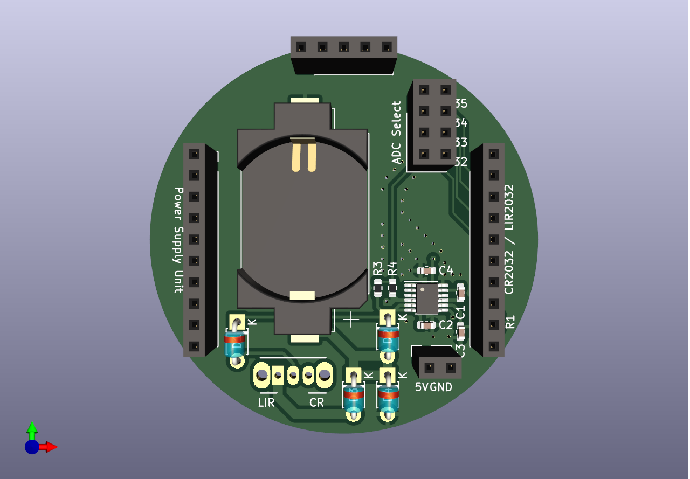
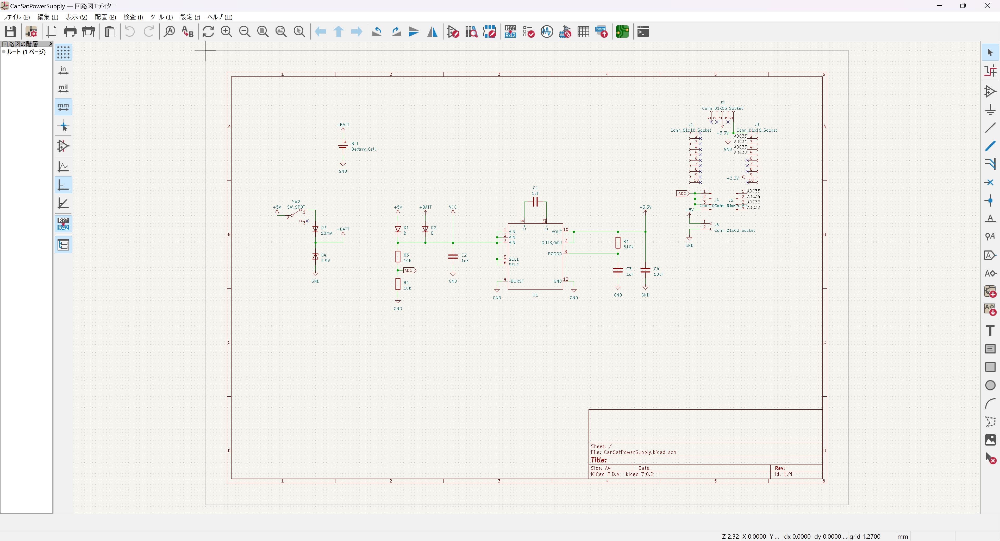
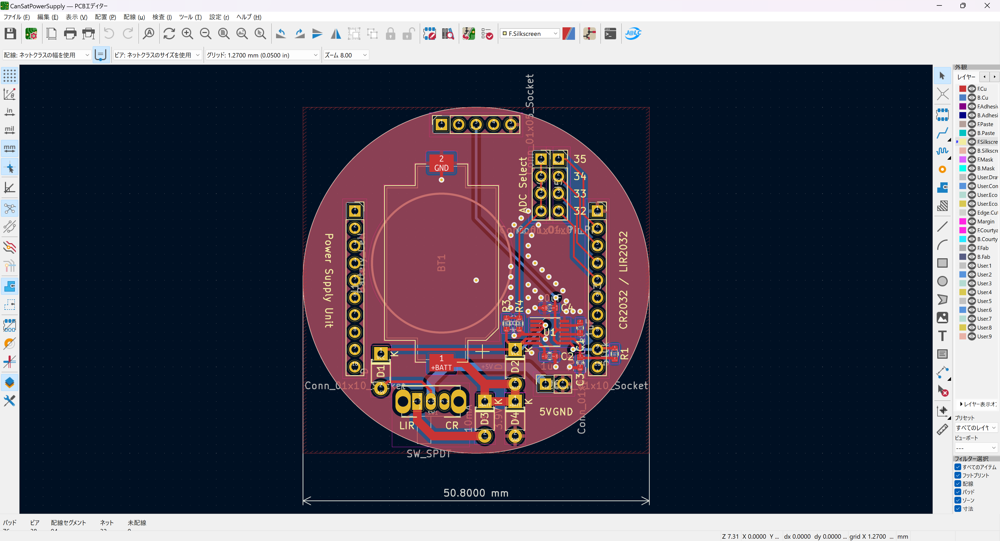

# CanSatPowerSupply

缶サット用自作マイコンボード向け電源ユニット  
CR2032 または LIR2032 が使用できます  
LIR2032 使用時，外部電源入力に 5V を供給することで 10mA 定電流ダイオードと 3.9V 定電圧ダイオードでの簡易 CCCV 充電が可能です

また，電源電圧監視用 ADC 入力が可能で，GPIO32 ~ GPIO35 を入力として選択可能です

# 部品表

| 部品番号 | 部品名 | 秋月 |
|----|----|----|
| BT1 | バッテリホルダ | <https://akizukidenshi.com/catalog/g/g111348/> |
| C1 ~ C3 | 1uF 0603-1608M | <https://akizukidenshi.com/catalog/g/g114526/> |
| C4 | 10uF 0603-1608M | <https://akizukidenshi.com/catalog/g/g113161/> |
| D1, D2 | 1N4148 | <https://akizukidenshi.com/catalog/g/g100941/> |
| D3 | 定電流ダイオード 10mA | <https://akizukidenshi.com/catalog/g/g100185/> |
| D4 | 定電圧ダイオード 3.9V | <https://akizukidenshi.com/catalog/g/g108710/> |
| J1 ~ J3 | 分割ロングピンソケット | <https://akizukidenshi.com/catalog/g/g105779/> |
| SW1 | SPDT スイッチ | <https://akizukidenshi.com/catalog/g/g115703/> |
| U1 | LTC3245 | <https://akizukidenshi.com/catalog/g/g108177/> |

# ギャラリー

部品実装イメージ

回路図

CAD イメージ

